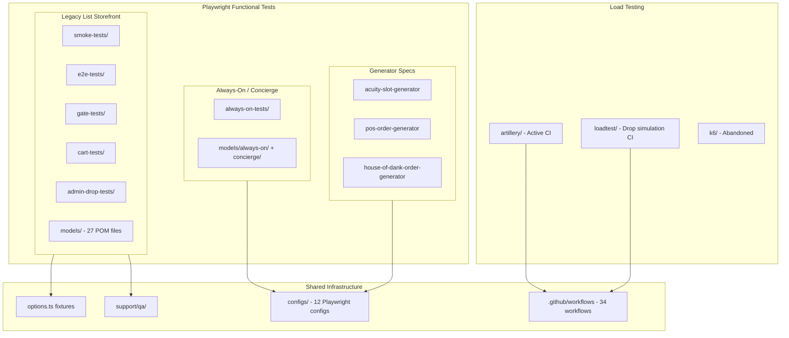

# Testing Suite Audit — Executive Overview

**Repository:** `seventen-functional-tests`  
**Audit date:** July 2026  
**Scope:** Full Playwright functional test suite for 710 Labs "The List" (CA, CO, MI, NJ, FL) and Always-On / Concierge products  
**Status:** Flag-only — no code changes were made as part of this audit

---

## Purpose

This audit documents the current state of a test suite that has grown organically over several years. It identifies duplication, dead code, configuration sprawl, and quality issues, and provides a phased roadmap for cleanup. All deletion and refactor candidates are **flagged for team review** — nothing is removed automatically.

---

## Suite Architecture

The repo is not a single homogeneous test suite. It is **three parallel testing stacks** sharing some infrastructure:

### Two Page Object Model (POM) Stacks

| Stack | Models | Tests | Target product |
|-------|--------|-------|----------------|
| **Legacy List** | `models/*.ts`, `models/admin/`, `models/admin-drop/` | `smoke-tests/`, `e2e-tests/`, `gate-tests/`, `cart-tests/`, `admin-drop-tests/` | State-specific WooCommerce storefronts (`thelist-*.710labs.com`) |
| **Always-On / Concierge** | `models/always-on/`, `models/concierge/` | `always-on-tests/` | Live / Concierge SPA (`live-dev.710labs.com`) |

These stacks share `options.ts` fixtures (`qaClient`, `domainState`, `orders`) but have **separate login, checkout, and cart flows** with no shared abstractions.

### Three Load Testing Approaches

| Stack | Status | CI | Purpose |
|-------|--------|-----|---------|
| `artillery/` | **Active** | 5 workflows | CA browser funnel, image upload stress, URL hits |
| `loadtest/` | **Active** | 1 workflow (manual dispatch) | Queue-It drop simulation, HTTP stampede |
| `k6/` | **Abandoned** | None | AI-generated prototype, never wired |

`artillery/artillery-scripts.js` and `loadtest/flows/funnel.js` duplicate ~1,000 lines of browser funnel logic.

---

## Headline Metrics

| Metric | Value |
|--------|------:|
| Playwright spec files | 32 |
| Total spec lines | ~4,526 |
| Page object model files | 27 (~9,002 lines) |
| Playwright configs (`configs/`) | 12 (all referenced by npm scripts) |
| Orphaned root configs | 3 (`playwright.config.ts`, `local.config.ts`, `utils_playwright.config.ts`) |
| npm scripts | 43 |
| GitHub workflows | 34 |
| `waitForTimeout` calls in models | ~182 |
| Estimated state-spec duplication | **65–70%** |
| Flagged dead/orphan files (Tier 1) | ~16 files (~195 KB) |
| Flagged abandoned files (Tier 2) | ~5 files + `legacy-tests/` |
| Dead methods inside live files (Tier 3) | ~15 |
| Unused npm dependencies | ~5–8 packages |

---

## Top 10 Highest-ROI Improvements

Ranked by impact vs. effort. See [CLEANUP_ROADMAP.md](./CLEANUP_ROADMAP.md) for phased implementation.

| # | Improvement | Impact | Effort | Phase |
|---|-------------|--------|--------|-------|
| 1 | **Parameterize 5 smoke specs → 1 data-driven spec** | Eliminates ~280 duplicate lines; single place to fix checkout/gate bugs | Medium | 3 |
| 2 | **Extract shared `passStorefrontGates` fixture** | Removes boilerplate from ~20 specs + 3 admin-drop copies | Low | 2 |
| 3 | **Collapse 3 always-on checkout flows** (`always-on/checkout-page.ts`) | ~600 lines of near-identical code | High | 4 |
| 4 | **Unify 5 cart-minimum variants** (`always-on/homepage-actions.ts`) | ~800 lines duplicated/commented in 1,877-line file | High | 4 |
| 5 | **Merge prod-ca/co/fl configs** (byte-identical except import) | 3 configs → 1 parameterized config | Low | 5 |
| 6 | **Fix tag taxonomy** (add `@CA`/`@CO`/etc. to smoke; add `@MI`/`@CO` to gate tests) | CI `--grep @XX` runs silently skip relevant tests today | Low | 2 |
| 7 | **Replace `order_id.txt` writes** with `testInfo.attach()` or QA API teardown | Eliminates race conditions in parallel runs | Low | 2 |
| 8 | **Delete Tier 1 dead code** (stale CSVs, `k6/`, orphaned configs) | ~195 KB removed; reduces confusion | Low | 1 |
| 9 | **Replace `waitForTimeout` with locator waits** (182 calls in models) | Biggest flakiness reduction | High | 4 |
| 10 | **Consolidate registration flows** in `create-account-page.ts` | 4 overlapping methods → 1 parameterized `create()` | Medium | 4 |

---

## Critical Findings Summary

### Duplication (see [DUPLICATION_REPORT.md](./DUPLICATION_REPORT.md))

- **Smoke tests:** 5 files (~404 lines) share ~69% identical structure. CO/NJ/FL are near-clones; MI diverges on checkout path.
- **E2E order tests:** CA/CO/NJ 4-test matrices are ~90% identical (~380 of ~420 lines). MI and FL are outliers.
- **Gate setup:** Age gate → list password → account creation repeated in ~20 specs without a shared fixture.
- **Page objects:** Three checkout edit flows, five cart-minimum loops, four registration methods — all copy-paste with minor deltas.

### Dead Code (see [DEAD_CODE_INVENTORY.md](./DEAD_CODE_INVENTORY.md))

- **2 model files never imported:** `scheduling-page.ts`, `admin/edit-profile-page.ts` (verified: zero imports outside their own files).
- **7 stale delivery-slot CSVs:** Zero grep hits anywhere in repo.
- **`k6/` folder:** Zero CI/npm references.
- **3 orphaned root Playwright configs** not referenced by any npm script or workflow.
- **~15 dead methods** inside otherwise-active files (e.g. `confirmCheckoutDeprecated`, `createColoradoCustomer` only referenced in a comment).

### Quality Issues (see [CODE_QUALITY_ISSUES.md](./CODE_QUALITY_ISSUES.md))

- **182 `waitForTimeout` calls** across models — primary flakiness source.
- **Mixed ESM + CommonJS** in 9 model files (`export` + `module.exports`).
- **Hardcoded `test1234` password** in smoke, e2e, and generator specs.
- **`order_id.txt` written from parallel tests** — gitignored but historically committed; race-prone.
- **Broken lint/format config:** `eslintrc.json` and `prettierrc.json` missing leading dot; ESLint packages not installed.
- **No spec-level assertions** in e2e order tests — all assertions live in page objects.

### CI / Config Gaps

- Smoke tests lack state tags (`@CA`, `@CO`, etc.) so `ci:test:dev:co` does not run smoke tests.
- Gate tests missing `@MI` and `@CO` tags — state-filtered CI runs skip them.
- `smoke:test:dev:ca` uses `prod-ca.config.ts` with dev URL — misleading script name.
- FL and NJ absent from PR validation workflow.
- Hardcoded Tesults JWT duplicated across 8 config files.

---

## Audit Document Index

| Document | Contents |
|----------|----------|
| [AUDIT_OVERVIEW.md](./AUDIT_OVERVIEW.md) | This file — executive summary and architecture |
| [DEAD_CODE_INVENTORY.md](./DEAD_CODE_INVENTORY.md) | Tiered flag list of all dead/orphan candidates with evidence |
| [DUPLICATION_REPORT.md](./DUPLICATION_REPORT.md) | Consolidation opportunities with before/after sketches |
| [CODE_QUALITY_ISSUES.md](./CODE_QUALITY_ISSUES.md) | Anti-patterns, tooling gaps, typo inventory |
| [CLEANUP_ROADMAP.md](./CLEANUP_ROADMAP.md) | 6-phase implementation plan with verification strategy |

---

## Existing Documentation Gaps (flagged, not edited)

| File | Issue |
|------|-------|
| `documentation/LIST_COVERAGE.MD` | Uses stale URL `thelist-staging.710labs.com`; codebase uses `thelist-stage.710labs.com` |
| `documentation/SUMMARY.MD` | References non-existent `visual_regression_analysis_5bb31c76.plan.md` |
| `documentation/CRON_SCHEDULES.MD` | Lists "Old" workflows without marking them deprecated |
| `documentation/` (general) | No load-testing documentation; ops live in root `README.md` and `loadtest/README.md` only |

---

## How to Use This Audit

1. **Review** [DEAD_CODE_INVENTORY.md](./DEAD_CODE_INVENTORY.md) — check off items the team agrees to delete.
2. **Prioritize** phases in [CLEANUP_ROADMAP.md](./CLEANUP_ROADMAP.md) based on current pain (flakiness → Phase 4 waits; CI gaps → Phase 2 tags).
3. **Execute** one phase at a time; each phase is independently shippable with its own verification strategy.
4. **Do not** batch-delete Tier 2 items without confirming no teammate runs them manually.
