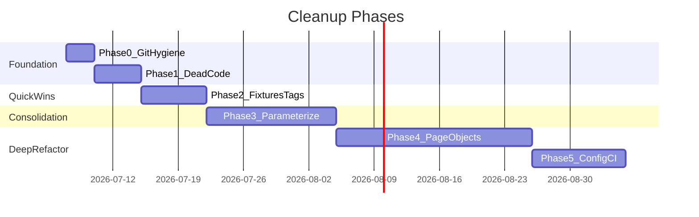

# Cleanup Roadmap

Phased implementation plan for test suite cleanup. Each phase is **independently shippable** — complete and verify one phase before starting the next.

All deletions require team sign-off using checkboxes in [DEAD_CODE_INVENTORY.md](./DEAD_CODE_INVENTORY.md).

---

## Phase Overview



| Phase | Focus | Risk | Est. line delta | Duration |
|-------|-------|------|----------------:|----------|
| 0 | Git hygiene + tooling | Very low | ~0 (config only) | 1–3 days |
| 1 | Delete approved dead code | Low | -~500 lines | 3–5 days |
| 2 | Fixtures, tags, env centralization | Low | -~300 lines | 5–7 days |
| 3 | Parameterize state specs | Medium | -~660 lines | 10–14 days |
| 4 | Page object refactors | Medium–High | -~1,800 lines | 14–21 days |
| 5 | Config consolidation + CI alignment | Medium | -~400 lines | 7–10 days |

---

## Phase 0 — Git Hygiene and Tooling

**Goal:** Fix broken tooling and stop committing runtime artifacts. No test logic changes.

### Tasks

| # | Task | Files |
|---|------|-------|
| 0.1 | Extend `.gitignore` | `.gitignore` — add `**/.DS_Store`, `artillery-reports/` |
| 0.2 | Remove committed artifacts from git index | `order_id.txt`, `.DS_Store` files, `artillery-reports/test.json`, root `CA-DL.jpg`, `Medical-Card.png` |
| 0.3 | Fix lint config filenames | Rename `eslintrc.json` → `.eslintrc.json`, `prettierrc.json` → `.prettierrc.json` (or delete prettierrc; rely on `package.json` block) |
| 0.4 | Add ESLint packages and lint script | `package.json` — add `eslint`, `eslint-config-prettier`, `eslint-plugin-prettier`, `"lint": "eslint ."` |
| 0.5 | Fix stale IDE config | `.vscode/settings.json` — remove reference to non-existent `playwright.yml` |
| 0.6 | Add audit index link to docs | `documentation/SUMMARY.MD` — add link to `documentation/audit/` (optional) |

### Verification

- [ ] `git status` shows no tracked `order_id.txt` or `.DS_Store`
- [ ] `npm run lint` runs without config errors
- [ ] `npx prettier --check .` uses consistent tabWidth (2)

### CI jobs to confirm no regression

None required — tooling-only changes.

---

## Phase 1 — Delete Team-Approved Dead Code

**Goal:** Remove Tier 1 items from [DEAD_CODE_INVENTORY.md](./DEAD_CODE_INVENTORY.md) after team review.

### Tasks

| # | Task | Files to delete |
|---|------|-----------------|
| 1.1 | Delete orphaned page objects | `models/scheduling-page.ts`, `models/admin/edit-profile-page.ts` |
| 1.2 | Delete orphaned root configs | `playwright.config.ts`, `local.config.ts`, `utils_playwright.config.ts` |
| 1.3 | Delete orphaned reporters | `reporters/slack/slack-alert-layout.ts`, `reporters/s3/pw-report-s3-upload-generators.ts` |
| 1.4 | Delete stale delivery-slot CSVs (7 files) | `utils/delivery-slots-{ca-old,2,4,co-june29,mi-july,culver-july,sticky-grove-july}.csv` |
| 1.5 | Delete unused zipcode JSONs | `utils/zipcodes-mi.json`, `utils/zipcodes-fl.json` |
| 1.6 | Delete `k6/` directory | `k6/script.js`, `k6/CA-DL.jpg`, `k6/Medical-Card.png` |
| 1.7 | Delete orphaned utility + spec | `utils/admin-drop/minimum-order-storefront.ts`, `utils/treez_inventory_test.spec.ts` |
| 1.8 | Remove unused npm deps | `fs-extra`, `pixelmatch`, `artillery-plugin-fake-data`, `artillery-plugin-faker`, `playwright-slack-report`, `@slack/web-api`, `@slack/types`; remove dead `pngjs` import from `account-page.ts` |
| 1.9 | Delete Tier 2 items (if team approves) | `legacy-tests/`, `auto-discount-tests.spec.ts`, `house-of-dank-order-generator.spec.ts`, `utils/hod-orders.csv` |

### Verification

- [ ] `npm install` succeeds after dep removal
- [ ] `npx playwright test --list` shows same test count as before (minus deleted specs)
- [ ] No import errors: `grep -r "scheduling-page\|edit-profile-page\|treez_inventory" --include="*.ts"`

### CI jobs to confirm no regression

| Job | Why |
|-----|-----|
| `seventen-thelist-dev-functional-tests.yml` (CA) | Core List test path |
| `seventen-thelist-pull-request-validation.yml` | PR gate |
| `admin-drop-smoke-phase1.yml` | Admin-drop unaffected by Tier 1 deletions |

**Estimated line delta:** -~500 lines + ~195 KB assets

---

## Phase 2 — Shared Fixtures, Tags, and Env Centralization

**Goal:** Remove boilerplate, fix CI tag gaps, eliminate parallel file-write races.

### Tasks

| # | Task | Files |
|---|------|-------|
| 2.1 | Create `utils/test-env.ts` | Centralize `CHECKOUT_PASSWORD`, `TEST_EMAIL_DOMAIN`, `BASE_URL` reads |
| 2.2 | Extract `passStorefrontGates` to shared helper | New `support/storefront-gates.ts`; update 3 admin-drop specs + optionally `age-gate-page.ts` consumers |
| 2.3 | Add `storefront` fixture to `options.ts` | `passGates()` + page object bundle |
| 2.4 | Replace `order_id.txt` writes | All smoke specs + `live.spec.ts` → `testInfo.attach('order-id', ...)` |
| 2.5 | Fix tag taxonomy | Add `@CA`/`@CO`/`@MI`/`@NJ`/`@FL` to smoke tests; add `@MI`/`@CO` to gate tests; normalize `@rec` → `@recreational` |
| 2.6 | Remove dead imports | `uuid`, `fictionalAreacodes` from smoke specs where unused |

### Before / After (fixture)

```typescript
// Before (every spec)
await test.step('Pass Age Gate', async () => { await ageGatePage.passAgeGate() })
await test.step('Enter List Password', async () => {
  await listPassword.submitPassword(process.env.CHECKOUT_PASSWORD || '')
})

// After
await storefront.passGates()
```

### Verification

- [ ] `ci:test:dev:co --list` now includes smoke tests (after tag fix)
- [ ] `ci:test:dev:mi --list` now includes gate tests
- [ ] Parallel smoke run produces no `order_id.txt` in repo root
- [ ] Admin-drop tests pass with shared `passStorefrontGates`

### CI jobs to confirm no regression

| Job | Why |
|-----|-----|
| `seventen-thelist-*-prod-smoke-test.yml` (all 5 states) | Smoke path with new tags |
| `seventen-thelist-dev-functional-tests.yml` (CO, MI) | Tag gap fixes |
| `admin-drop-smoke-phase1.yml` | Shared gate helper |
| `seventen-thelist-pull-request-validation.yml` | PR gate |

**Estimated line delta:** -~300 lines

---

## Phase 3 — Parameterize State Specs

**Goal:** Merge 5 smoke specs and CA/CO/NJ e2e matrices into data-driven tests.

### Tasks

| # | Task | Files |
|---|------|-------|
| 3.1 | Create `utils/smoke-state-configs.ts` | State parameter table |
| 3.2 | Create `tests/smoke-tests/smoke-order.spec.ts` | Single parameterized smoke spec |
| 3.3 | Delete old smoke specs | `smoke-test-{ca,co,mi,nj,fl}.spec.ts` |
| 3.4 | Update prod smoke npm scripts | `package.json` — point to `smoke-order.spec.ts` with `--grep @CA` etc. |
| 3.5 | Create `utils/e2e-state-configs.ts` | E2E parameter table |
| 3.6 | Create `tests/e2e-tests/order-matrix.spec.ts` | Parameterized 4-scenario matrix for CA/CO/NJ |
| 3.7 | Keep MI/FL as describe overrides or separate blocks | MI manual checkout, FL single-scenario |
| 3.8 | Add spec-level `expect(orderNumber)` to e2e tests | Minimum assertion per test |
| 3.9 | Unify MI checkout path | Decide: extend `confirmCheckout` or keep `manualMi` strategy in config |

### Verification

- [ ] Test count matches pre-merge: 5 smoke + 14 e2e matrix scenarios
- [ ] Each state smoke still runnable: `smoke:test:prod:mi`, etc.
- [ ] Mobile skip behavior preserved per state config
- [ ] MI still clicks `"I qualify"` age gate button (state-specific gate logic)

### CI jobs to confirm no regression

| Job | Why |
|-----|-----|
| All 5 `seventen-thelist-*-prod-smoke-test.yml` | Prod smoke per state |
| `seventen-thelist-dev-functional-tests.yml` (CA, CO, NJ) | E2E matrix |
| `seventen-thelist-stage-build-validation.yml` | Staging coverage |
| `seventen-thelist-pull-request-validation.yml` | PR gate |

**Estimated line delta:** -~660 lines

---

## Phase 4 — Page Object Refactors

**Goal:** Split mega-files, remove duplication, replace hardcoded waits. Highest effort phase — tackle one file per PR.

### Recommended PR Sequence

| PR | File | Action | Est. savings |
|----|------|--------|-------------|
| 4a | `models/always-on/homepage-actions.ts` | Delete L876–1116 commented block; unify 5 cart-minimum methods; remove dead public methods | ~800 lines |
| 4b | `models/always-on/checkout-page.ts` | Extract `CheckoutSections`; collapse 3 checkout flows; remove `enterPhoneNumber` | ~600 lines |
| 4c | `models/create-account-page.ts` | Merge 4 registration methods into parameterized `create()`; remove `createColoradoCustomer` | ~400 lines |
| 4d | `models/shop-page.ts` | Merge `addProductsToCart` + `addProductsToCartPickup`; delete `addSameProductToCart` (empty locator bug) | ~50 lines |
| 4e | `models/checkout-page.ts` | Remove `confirmCheckoutDeprecated` | ~50 lines |
| 4f | Wait replacement pass | Replace `waitForTimeout` with locator waits in refactored files first, then remainder | Flakiness reduction |
| 4g | Module system cleanup | Remove `module.exports` from 9 model files; standardize imports | Consistency |
| 4h | Typo fixes | Rename `order-recieved-page.ts` → `order-received-page.ts` (separate PR; update all imports) | Clarity |
| 4i | Selector hardening | Replace `text=` with `getByRole` in touched files | Maintainability |
| 4j | Console.log cleanup | Remove debug logging from `homepage-actions.ts`, `checkout-page.ts` | CI noise reduction |

### Verification (per PR)

- [ ] Targeted always-on CI: `live:ci:always-on`, `concierge:ci:tests`
- [ ] Targeted List CI for affected state
- [ ] No new `waitForTimeout` introduced
- [ ] `npm run lint` passes

### CI jobs to confirm no regression

| Job | Covers |
|-----|--------|
| `live-dev.yml` / `live-stage.yml` | Always-on rec/med flows |
| `concierge-dev.yml` / `concierge-stage.yml` | Concierge flows |
| `seventen-thelist-dev-functional-tests.yml` (CA) | Legacy List POMs |
| `admin-drop-smoke-phase1.yml` | Admin-drop storefront POMs |

**Estimated line delta:** -~1,800 lines

---

## Phase 5 — Config Consolidation and CI Alignment

**Goal:** Collapse duplicate Playwright configs, align CI with npm scripts, externalize secrets.

### Tasks

| # | Task | Files |
|---|------|-------|
| 5.1 | Create `configs/shared/list-base.ts` | Shared reporters, projects, use defaults |
| 5.2 | Merge `prod-ca/co/fl` → `configs/prod.config.ts` | Parameterized by `BASE_URL` + `ORDERS_PROFILE` |
| 5.3 | Merge `dev` + `staging` → `configs/list.config.ts` | `ENV=dev\|staging` switch |
| 5.4 | Update all npm scripts to new config paths | `package.json` |
| 5.5 | Move Tesults token to `TESULTS_TOKEN` env var | All configs using tesults reporter |
| 5.6 | Fix `smoke:test:dev:ca` to use dev config | `package.json` L28 |
| 5.7 | Add FL/NJ to PR validation workflow | `.github/workflows/seventen-thelist-pull-request-validation.yml` |
| 5.8 | Consolidate admin smoke CI to use `admin-smoke-all.js` | `admin-drop-smoke-phase1.yml` |
| 5.9 | Align Acuity workflow QA endpoint to REST path | `seventen-thelist-acuity-slot-automation.yml` |
| 5.10 | Extract shared funnel module (optional, long-term) | `shared/funnel-steps.js` used by artillery + loadtest |
| 5.11 | Update documentation | Fix `LIST_COVERAGE.MD` staging URL; add load-test section |

### Config Reduction Target

| Before | After |
|--------|-------|
| 12 configs in `configs/` | 5–6 configs |
| 3 orphaned root configs (deleted in Phase 1) | 0 |
| Hardcoded Tesults JWT in 8 files | 1 env var |

### Verification

- [ ] All 43 npm scripts resolve to valid config files
- [ ] `ci:test:dev:ca` and `ci:test:staging:ca` produce same test list as before
- [ ] Prod smoke scripts still target correct state specs
- [ ] GitHub Actions workflows pass with new config paths
- [ ] No secrets in committed config files

### CI jobs to confirm no regression

Run full workflow suite or at minimum:

| Workflow group | Count |
|----------------|------:|
| Dev functional tests (CA, MI, CO, NJ) | 4 |
| Staging build validation (CA, MI, CO, NJ, FL) | 5 |
| Prod smoke (CA, CO, FL, MI, NJ) | 5 |
| Always-on (live, concierge, employee) | 6 |
| Admin-drop smoke | 1 |
| Acuity automation | 1 |
| Artillery load tests | 1 (manual) |

**Estimated line delta:** -~400 lines

---

## Post-Cleanup Target State

| Metric | Current | Target |
|--------|--------:|-------:|
| Spec files (state tests) | 10 (5 smoke + 5 e2e) | 2–3 parameterized |
| Playwright configs | 15 (12 + 3 orphaned) | 5–6 |
| POM files > 1,000 lines | 3 | 0 |
| `waitForTimeout` in models | ~182 | < 20 |
| Orphaned files | ~35 flagged | 0 |
| Tag coverage gaps | 5 states affected | 0 |
| Hardcoded secrets in configs | 8 | 0 |

---

## Risk Mitigation

| Risk | Mitigation |
|------|------------|
| Deleting file a teammate runs manually | Phase 1 requires checkbox sign-off in DEAD_CODE_INVENTORY |
| Parameterized specs harder to debug | Keep per-state `--grep @CA` filter; log state config at test start |
| Page object refactor breaks prod smoke | One file per PR; run prod smoke workflow on refactor branches |
| Config merge breaks CI secrets | Update workflows in same PR as config change; test with `workflow_dispatch` |
| MI checkout path regression | Explicit `manualMi` strategy in config; dedicated MI verification in Phase 3 |

---

## Suggested Execution Order for a 2-Person Team

**Sprint 1 (Week 1):** Phase 0 + Phase 1 (team reviews DEAD_CODE_INVENTORY checkboxes)  
**Sprint 2 (Week 2):** Phase 2  
**Sprint 3–4 (Weeks 3–4):** Phase 3  
**Sprint 5–7 (Weeks 5–7):** Phase 4 (one PR per file)  
**Sprint 8 (Week 8):** Phase 5  

Phases 2 and 3 can overlap if different people own fixtures vs. spec parameterization.

---

## Related Documents

- [AUDIT_OVERVIEW.md](./AUDIT_OVERVIEW.md) — Executive summary and architecture
- [DEAD_CODE_INVENTORY.md](./DEAD_CODE_INVENTORY.md) — Tiered deletion candidates with review checkboxes
- [DUPLICATION_REPORT.md](./DUPLICATION_REPORT.md) — Before/after consolidation sketches
- [CODE_QUALITY_ISSUES.md](./CODE_QUALITY_ISSUES.md) — Anti-patterns and tooling gaps
